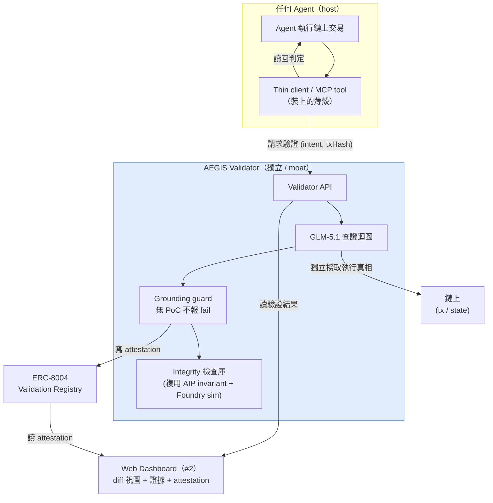
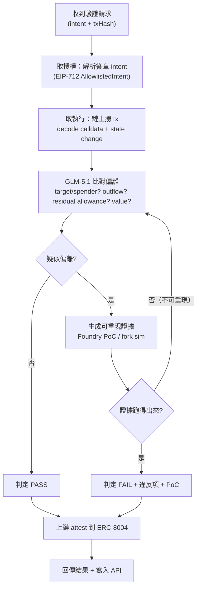
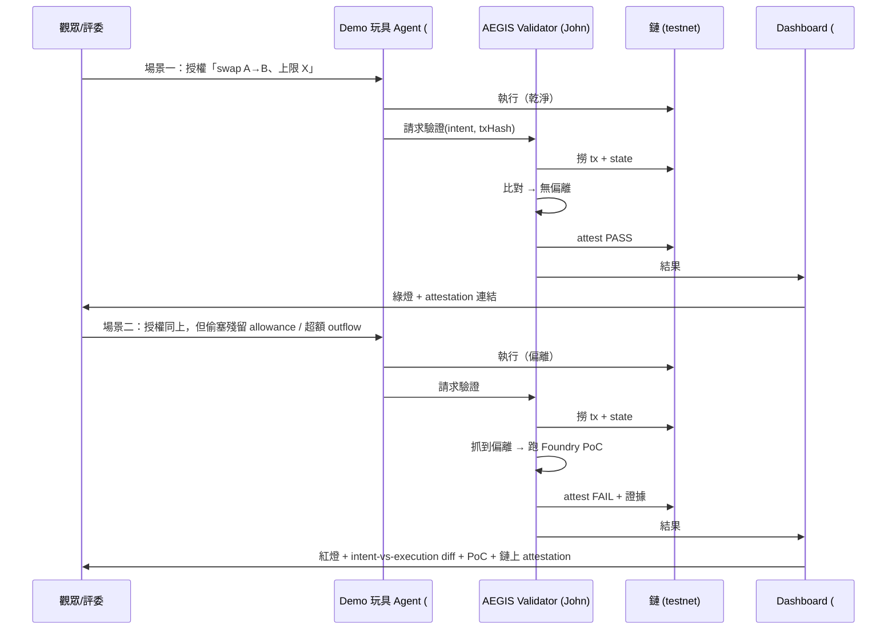
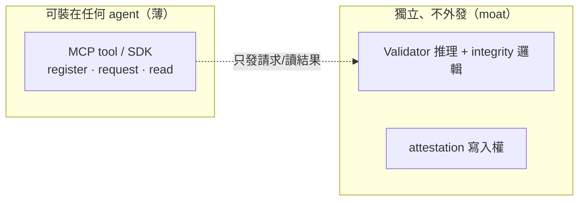

# 流程圖 / 架構 — AEGIS

> draft-1 · 2026-06-04 · 配合 `PROPOSAL.md`、`HANDOFF.md`
> 圖用 Mermaid（GitHub / Obsidian / VS Code 直接 render）

---

## 1. 系統架構（誰跟誰講話）

> 關鍵：client 裝在 host 上，但 **validator 自己去鏈上撈執行真相**（不信 host 自述）→ 獨立性成立。

---

## 2. Validator 查證迴圈（核心邏輯）

> `Q2 否 → 回 P3`：這條迴圈就是 grounding guard —— 報不出可重現證據就不准定 fail，逼它重查或收回。也是「長程 / 自我糾錯」評審項的來源。

---

## 3. Demo 流程（Demo Day 3–5 分鐘）

---

## 4. 兩側拆分（哪塊裝得上、哪塊是 moat）

> 「裝在所有 agent 上」的是左邊薄殼；判定與 attestation 來源永遠在右邊獨立側 → 避免「自己證自己」的循環。
