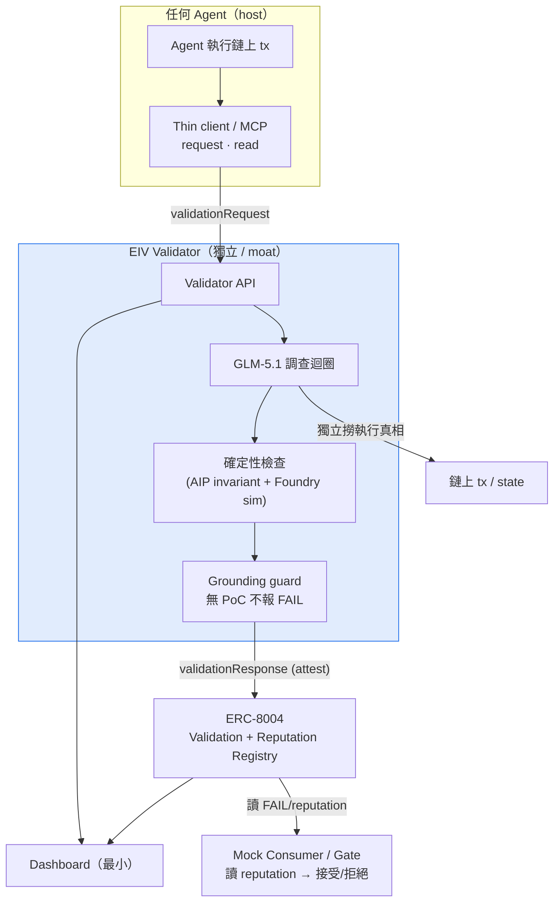
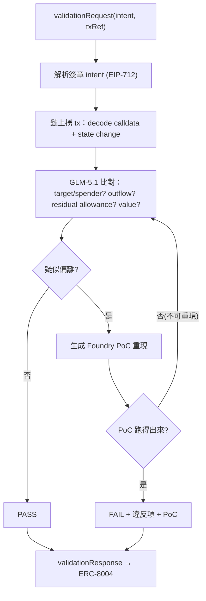
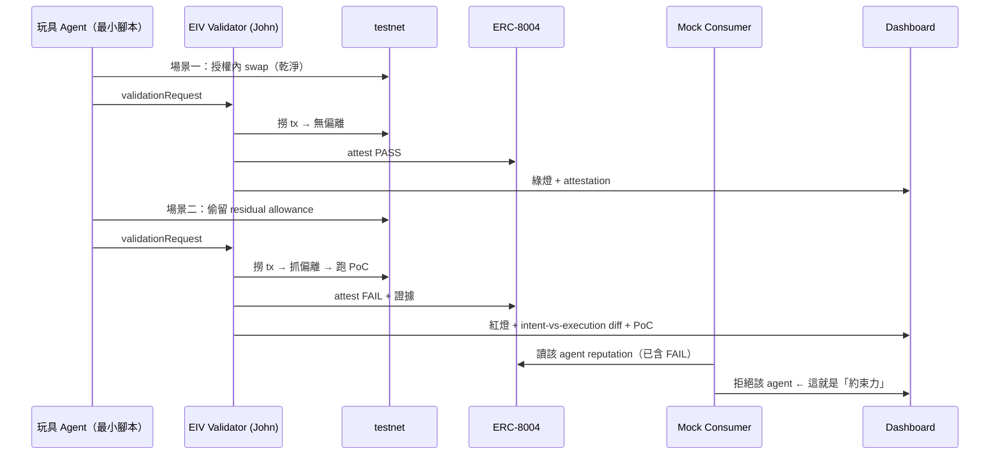

> 📄 完整當前文檔(onboarding)見 `EIV-DOCS.md`;本檔為設計細節 archive。

# DESIGN — Independent Execution-Integrity Validator for Agents

> **工作代號 `EIV`(Execution-Integrity Validator)— 佔位,團隊改名**(原 `AEGIS` 撞名,棄用)
> AI × Web3 Agentic Builders Hackathon · **Z.AI 賽道(Web3 × Long-Horizon Task)**
> **v2 · 2026-06-05 · 取代 draft-1 的 PROPOSAL/ARCHITECTURE/HANDOFF**(那批含 Hermes / 閘門化 / 未核 ERC-8004,已過時)
> **v2.1 patch · 2026-06-07**:已解 §14 拍板(目標鏈 = ETH Sepolia · ERC-8004 pin master commit / Identity·Reputation 已部署 / Validation Registry 自部署 · 團隊 2 人)+ 同步 §8、§11。
> ⚠️ **完整 v3 body-sync 尚未做**:以下 v3 deltas 已在 `week3/` Ready Pack 採用、但**尚未併入本文 body**(§3/§5/§10):① model-agnostic 顯式化(GLM-5.1 僅為賽道 demo backend)② L1/L2/L3 分層(本案定位 L2 authorization-conformance)③ 三級 severity:FAIL / WARN-SAFETY / WARN-SPEC ④ violation taxonomy A–G(MVP = A/C/D/F)⑤ spec-source-agnostic。下次整訂時併入並 bump v3。
> 狀態:草稿待 review;技術主張已回主來源核(見文末 Sources + ⚠️ 標記)

---

## 0. 一句話

一隻**獨立、GLM-5.1 驅動的驗證 agent**:事後查證「某 agent 的鏈上交易有沒有照它被授權的 intent 執行」,把判定 attest 進 **ERC-8004 Validation Registry**;累積的判定餵 reputation,讓生態能拒絕亂來的 agent。**不碰錢、不擋交易、不是錢包。**

## 1. 問題(第一性)

授權(intent)與執行(tx)是兩個分開的事件,**沒有東西天生保證一致**。agent 拿「換最多 100 USDC、只走 router R」的授權,實際那筆可能多留 allowance、超額、打到別處。
**不解的後果**:沒有獨立、公開的紀錄能證明 agent 有沒有照辦 → 規模化把錢交給 agent 的信任天花板。

## 2. 它「不是」什麼(定位防混淆)

- **不是錢包 / 不是 enforcer**:它不在執行路徑裡、不擋交易(那是 AIP / FluxA / Cobo 的 enforcement)。
- **不是即時牽繩**:它事後驗 + 記錄,不阻止當下那一筆。約束力來自 reputation/究責,見 §6。
- **不是身份 / TEE validator**:ERC-8004 上現有 validator(Oasis ROFL、Phala TEE、Reclaim ZK)驗的是「誰在操作 / 代碼可信」;**我們驗的是「執行有沒有對上 intent」—— 這格目前真空。**

## 3. 方法

事後流程:agent 帶簽章 intent 上鏈執行 → 透過薄 client 請求驗證 → validator **自己上鏈撈 tx** → GLM-5.1 比對偏離 → **疑點必須跑出可重現 PoC 才算 FAIL(grounding guard)** → 判定 attest 進 ERC-8004 → reputation 累積 → 生態 consumer 可據此拒絕。

**驗證方法(9 天版)**:
- **確定性檢查(判定的真)**:複用 AIP 的 invariant(allowlist / outflow cap / residual-allowance / value)+ Foundry/fork 模擬。
- **GLM-5.1(調查的腦)**:詮釋鬆散 intent、決定查什麼、編排多步調查、抓未列舉的偏離、講人話、起草 PoC。**被 grounding guard 綁:無可重現證據不得定 FAIL。**
- 砍掉:zkML / TEE validator(future)。

## 4. 架構圖

### 4.1 系統

### 4.2 驗證迴圈

### 4.3 Demo 流程(秀出「牙」)

## 5. 第一性原理拆解

| # | 不可再分的真相 | 被逼出的設計 |
|---|---|---|
| 1 | 授權與執行分開,無物天生保證一致 | 必須有「驗證」 |
| 2 | 執行方驗自己對懷疑者零資訊 | **獨立**第三方 |
| 3 | 判定要對他人有用須可依賴/不可竄改/可追溯 | **公開上鏈 attestation(ERC-8004)** |
| 4 | 獨立者只能驗它能獨立觀察的 | **只驗鏈上**;鏈下 future |
| 5 | LLM 的斷言≠證據;誤報摧毀唯一資產(可信度) | **grounding guard**:FAIL 須還原成可重跑事實 |
| 6 | 偏離方式是開放集合、intent 可能寫得鬆 | **GLM-5.1 調查**,確定性檢查當真相源 |
| 7 | 要被採用接入成本要低,但判定留獨立側 | **薄 client + 獨立 validator** |

**最深的洞見(也是最強差異化)**:因為 grounding guard,**FAIL 判定可重跑 —— 你不用信我的判斷,自己跑 PoC 就知道,這一半 trustless**。但 **PASS(沒驗出問題)無法被證明**,依賴覆蓋率與誠實 → production 才靠 staking/zkML/TEE 補(ERC-8004 的方法)。9 天**只誠實聲明這條邊界**。

**AP2 三支柱定位(核過的標準)**:Authorization → AIP 擋 / 我們驗;**Accountability → 我們的 attestation+reputation 正是這個**;Authenticity(agent 是否忠實反映用戶真實意圖)→ **第三層,沒人解、最難、future**。

## 6. 約束力（teeth）從哪來

**= ERC-8004 的 reputation / 究責層,不是即時攔截。** FAIL 累積 → agent 鏈上 reputation 掉 → 生態(對手 / 用戶 / 別人的 gate)拒絕它。這是「持久身份 + validation + reputation」三件套設計來幹的事;對需長期/規模運作的管錢 agent,這就是有效約束(同信用紀錄/審計約束企業)。
**Demo 用 mock consumer 演出來**(§4.3):agent 因 FAIL reputation 被拒 → 牙看得見,我們卻不碰錢、不自建 escrow、保持獨立。
**誠實 tradeoff**:這是究責/信任基礎設施,**不是即時牽繩**。要即時擋單筆 → 那是 enforcement,對本 niche 做 enforcement = 重做 AIP(更難更擠),不走。

## 7. 為什麼是 post-hoc 不是閘門化（grounded）

- ERC-8004 Validation **原生就是 post-hoc(request→respond)**,且明文「payments orthogonal」—— 沒有 gating,閘門全得自建(off-standard)。✅ 核過 EIP。
- 對「執行完整性」niche,閘門化會**塌回 AIP 的 commitment/binding 問題 + in-path enforcement** → 更難、更不差異化。
- 執行完整性本就**看了執行才驗得準** → 天生偏 post-hoc。

## 8. ERC-8004 整合（核過）

- 介面:`validationRequest(validator, agentId, requestURI, requestHash)` → `validationResponse(requestHash, response, responseURI, responseHash, tag)`。
- 驗證對象是 **agentId + 資料 hash commitment(非單一 tx)** → 我們把 **intent + txRef 編進 requestURI/requestHash**,語意自定。
- 用官方 **`erc-8004/erc-8004-contracts`**,不重寫 registry。**repo 無 releases/tags → pin master commit hash**(build 時記實際 HEAD);license CC0。repo 為 TS+Solidity(附 ABI),無 Foundry-native lib → 由 ABI 寫 Solidity interface 接進 Foundry。
- **Identity Registry `0x8004A818BFB912233c491871b3d84c89A494BD9e` / Reputation Registry `0x8004B663056A597Dffe9eCcC1965A193B7388713` 已部署於 Sepolia(多鏈同地址,Monad 亦同)→ 直接用。**
- ⚠️ **Validation Registry(本案核心依賴)仍在跟 TEE 社群討論、無 canonical 已部署地址(in-flux)→ 自部署最小相容版**(= §12 既有備案,直接採用,不阻塞)。

## 9. 建什麼 vs 複用

- **複用(可行性)**:AIP 的 EIP-712 intent、invariant 檢查庫、Foundry。
- **新做(成長)**:GLM-5.1 調查迴圈 + grounding guard、ERC-8004 整合 + attest、薄 client(MCP)、dashboard、mock consumer。
- **runtime:TBD,不綁 Hermes** —— 只需「LLM 迴圈 + tool-calling + 能跑檢查」,輕量自寫 loop 可能更乾淨、更好掌控。

## 10. 範圍

- **MVP**:on-chain 執行完整性 post-hoc 驗證、GLM-5.1+Foundry grounded、ERC-8004 attest、2–3 場景、dashboard + mock consumer。
- **Future**:閘門化/pre-exec、鏈下行為、zkML/TEE validator-trust、Authenticity/反 poisoning(讀法 B 那個上游問題)。

## 11. 團隊與里程碑

> **更新(2026-06-07):團隊縮為 2 人**,原技術 #2 退出無接替 → John 一人承擔全部技術;**dashboard 砍到最小**(表格/靜態頁/CLI viewer,非 polished web app)。

| 角色 | 主責 |
|---|---|
| **John(技術 lead)** | **全部技術**:validator 核心 + 檢查邏輯 + chain adapter + ERC-8004 整合 + attest + MCP + 最小 dashboard + 玩具 agent + 部署 |
| **Anemoia(運營)** | **全部非程式**:pitch + 3–5 分鐘影片 + README/proposal + 提交 + 發布賽道推文 + Demo Day + 協調 |

| 日期 | 目標 |
|---|---|
| 6/5（今）| 鎖本 docs + 凍結介面 schema + 假資料 walking skeleton |
| 6/6–6/7 | 骨架:validator 迴圈、ERC-8004 接官方合約、web 殼接 mock |
| 6/8–6/10 | 填肉:checks+grounding、diff 視圖、mock consumer、真資料整合 |
| 6/11–6/12 | end-to-end、2–3 場景、邊界硬化、錄影、README |
| **6/13 12:00** | 提交 |
| 6/14 | Demo Day |

## 12. Pre-mortem（假設輸了,回推）

| 死法 | 先擋好 |
|---|---|
| 整合最後一天接不起來 | Day-1 凍結介面 + 假資料 walking skeleton |
| 評委問「憑什麼信 validator」沒答好 | §5 洞見當武器:FAIL 可重跑、PASS 有界、staking/TEE 是 future |
| 做成薄 LLM 包裝(非真長程 agent) | 刻意建多步調查迴圈,log/demo 顯式秀長程 |
| ERC-8004 Draft 介面變 / 吃時間 | 用官方合約 + pin 版本;備案自寫最小相容 registry |
| John 過度打磨核心,排擠整合/demo | 核心 timebox;「夠好+整合+可演示」優先(過程我盯) |
| 贏深度輸直觀 | dashboard diff(money shot)+ 運營 pitch 把深度翻成看得懂 |

## 13. 誠實的已知限制

- **非即時防護**:究責/信任層,不阻止單筆(§6)。
- **validator 信任**:FAIL 可重跑(trustless 一半);PASS 有界,靠覆蓋率/誠實,production 才上 staking/TEE。
- **非首創**:已有相鄰前作(arxiv 2511.15712、2512.17259;Mastercard/Visa/AP2 在驗授權/身份)。**我們的邊=「grounded 執行完整性」這個切法 + ERC-8004 上的真空 validator 類型。**

## 14. 拍板狀態(2026-06-07 更新)

**已拍板:**
- **codename** = 沿用 **EIV(Execution-Integrity Validator)**。
- **目標鏈** = **ETH Sepolia**。理由:Sepolia 上 DeFi/swap 活動較真實 → 有真 tx 可驗(Monad testnet DeFi 太薄);ERC-8004 已部署在 Sepolia;工具成熟(Etherscan-Sepolia / Foundry / RPC)。PoC 走 Foundry mainnet-fork(複用 AIP fork 測試),attest 打 Sepolia。註:ERC-8004 在 Monad 亦有部署(同地址),非互斥,選 Sepolia。
- **ERC-8004**(見 §8):pin master commit(無 tags;CC0);Identity/Reputation 已部署直接用;**Validation Registry 自部署最小相容版**(in-flux)。
- **團隊** = **2 人**:John(技術 lead,做全部技術)+ Anemoia(運營,扛全部非程式)。原假定的技術 #2 已退出(無接替)→ 「技術 #2 能否碰 Solidity」已成 moot;**僅 1 開發者 → dashboard 砍到最小**(表格/靜態頁/CLI viewer,非 polished web app;見 §11 更新)。兩人皆大致全程在線,UTC+8,溝通走 TG / Twitter / WeChat。

**仍開放:**
- ERC-8004 Validation Registry 上游後續會變(持續追);reputation 採納機制(誰願採信)。

## Sources（已核）

- [ERC-8004 EIP](https://eips.ethereum.org/EIPS/eip-8004)（✅ Validation 介面 / post-hoc / payments orthogonal）
- [官方 erc-8004-contracts](https://github.com/erc-8004/erc-8004-contracts)
- [Reclaim ERC-8004 ZK validator](https://github.com/reclaimprotocol/reclaim-8004-validator) · [Oasis erc-8004](https://github.com/oasisprotocol/erc-8004)
- [AP2 官方](https://cloud.google.com/blog/products/ai-machine-learning/announcing-agents-to-payments-ap2-protocol)（三支柱）
- [arxiv 2511.15712](https://arxiv.org/abs/2511.15712) · [arxiv 2512.17259](https://arxiv.org/pdf/2512.17259)（相鄰前作）
