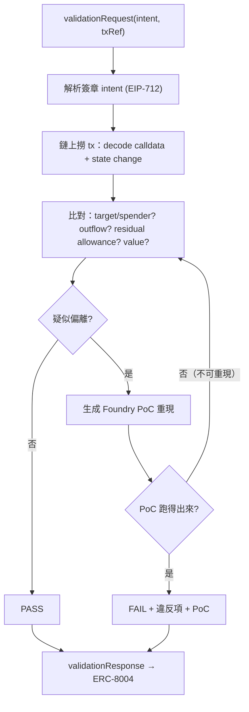
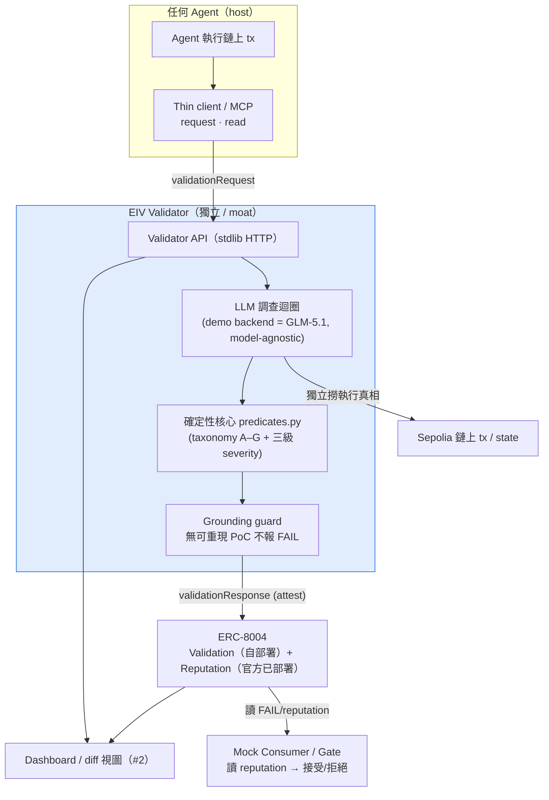
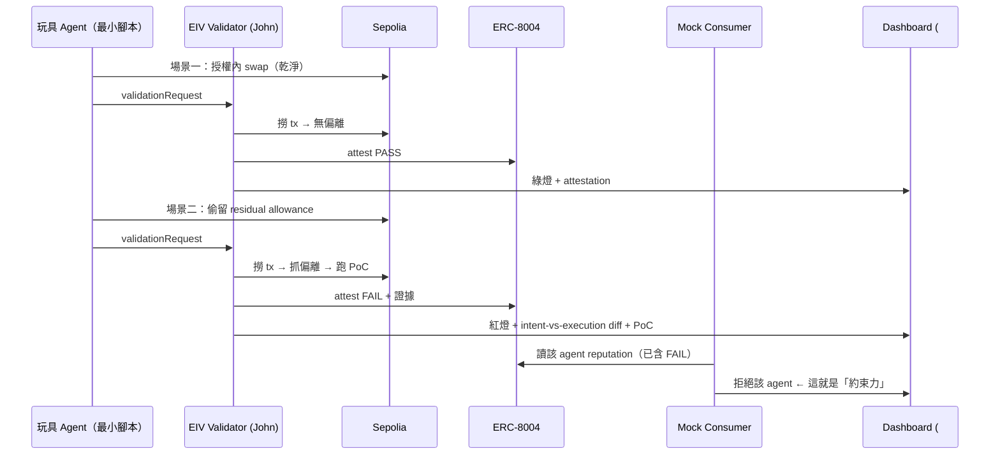

# EIV — Complete Project Docs (v3)

> **EIV(Execution-Integrity Validator)** · AI × Web3 Agentic Builders Hackathon · **Z.AI 賽道(Web3 × Long-Horizon Task)**
> **v3 · 2026-06-07** — 單一、當前、self-contained 的 onboarding 文件。整合並取代散落各處的當前狀態。
> 狀態:草稿(DRAFT)。技術主張皆回主來源核過(見 §19 Sources)。無金鑰 / 憑證 / 網路動作。

---

## 0. 這份文檔是什麼 / 給誰 / 整合了哪些來源

**一句話**:EIV 是一隻**獨立、事後(post-hoc)**的驗證 agent —— 它查證「某個 AI agent 的一筆鏈上交易,有沒有照它**簽章的授權(intent)**執行」,把判定 **attest 進 ERC-8004**,累積成 reputation,讓生態能據此拒絕亂來的 agent。**它不碰錢、不擋交易、不是錢包。**

**給誰**:一位回來歸隊的**技術夥伴**(尤其是第二位技術成員 #2)。讀完這一份應能完整 onboard:知道我們在解什麼問題、系統定位、現在跑到哪、怎麼把它跑起來、Week 4 各自做什麼。

**它整合了哪些來源(本檔為這些的當前彙整)**:
- `hackathon/DESIGN.md`(v2.1,設計細節 archive;其 v3 deferral 已併入本檔 body)
- `hackathon/eiv/REPORT.md`(2026-06-07 獨立核實的 walking-skeleton 完成報表)
- `hackathon/eiv/README.md` + `eiv/predicates.py`(實作與凍結契約)
- `week3/*.md`(已拍板的 Week-3 Ready Pack:賽道對齊、ERC-8004 事實、sprint、scope、risk 等)
- `daily/2026-06-05｜06｜07.md`(決策軌跡)

**本檔與 DESIGN.md 的關係**:本檔(EIV-DOCS.md)= 當前 onboarding 真相;DESIGN.md = 設計細節與第一性推導的 archive。兩者衝突時以本檔為準。本檔不重貼每份 week3 檔案逐字,細節指回子文件(見 §18 檔案地圖)。

---

## 1. 問題(第一性)

授權(intent)與執行(tx)是**兩個分開的事件,沒有東西天生保證一致**。

一隻 agent 拿到「換最多 100 USDC → WETH、只走 router R、產出回用戶、執行後 allowance 歸零」的簽章授權。它實際送上鏈的那筆交易,可能:多留 allowance、超額、打到別的合約、產出送到別處。

**不解的後果**:沒有獨立、公開、不可竄改的紀錄能證明 agent 有沒有照辦。這就是**規模化把錢交給 agent 的信任天花板** —— 你無法在事後向第三方證明一隻 agent 是否守規。

第一性拆解(逼出的設計):

| # | 不可再分的真相 | 被逼出的設計 |
|---|---|---|
| 1 | 授權與執行分開,無物天生保證一致 | 必須有「驗證」 |
| 2 | 執行方驗自己,對懷疑者零資訊 | 必須是**獨立**第三方 |
| 3 | 判定要對他人有用,須可依賴 / 不可竄改 / 可追溯 | **公開上鏈 attestation(ERC-8004)** |
| 4 | 獨立者只能驗它能獨立觀察的 | **只驗鏈上**;鏈下行為列 future |
| 5 | LLM 的斷言 ≠ 證據;誤報摧毀唯一資產(可信度) | **grounding guard**:FAIL 須能還原成可重跑事實 |
| 6 | 偏離方式是開放集合、intent 可能寫得鬆 | **LLM 調查** + 確定性檢查當真相源 |
| 7 | 要被採用,接入成本須低,但判定須留獨立側 | **薄 client + 獨立 validator** |

---

## 2. 它是什麼 / 它不是什麼(定位防混淆)

**是**:一個獨立、事後、對「執行 vs 簽章授權」做 grounded 比對的驗證 + 究責(accountability)基礎設施。

**不是**:
- **不是錢包 / 不是 enforcer** —— 它不在執行路徑裡、不擋交易。in-path enforcement 是 AIP / FluxA / Cobo 那條路。
- **不是即時牽繩** —— 它事後驗 + 記錄,不阻止當下那一筆;約束力來自 reputation / 究責(見 §7)。
- **不是身份 / TEE validator** —— ERC-8004 上現有 validator(Oasis ROFL、Phala TEE、Reclaim ZK)驗的是「誰在操作 / 代碼可信」;**我們驗的是「執行有沒有對上 intent」——這格目前真空。**
- **不自己發明授權格式** —— 我們驗既有的簽章授權標準(見 §5 spec-source-agnostic),不另立新 spec(那是 adoption 死法)。

---

## 3. 三層忠誠度 L1 / L2 / L3(本案 = L2)

把「agent 的執行忠不忠」拆成三層,EIV 明確定位 **L2**:

| 層 | 問的問題 | 誰負責 / 狀態 |
|---|---|---|
| **L1 — Policy / Safety** | 這筆操作本身安不安全(allowance、outflow、target 是否危險)? | 偏 policy/safety 檢查;EIV 的確定性核心順帶覆蓋部分 |
| **L2 — Authorization-Conformance(本案)** | 有沒有照**簽章授權的欄位**做?(違規 = 違反 spec 寫明的欄位) | **EIV 的定位** —— 客觀、可重現 |
| **L3 — Semantic Intent / Authenticity** | agent 是否**忠實反映用戶真實意圖**(即使授權寫得對)? | = AP2 的 Authenticity;公認最難、**目前無人解、future**,EIV **不宣稱** |

**L2 vs L3 的客觀性界線(關鍵紀律)**:用一個未授權的 router 換到了**更好**的價 —— EIV 仍判 **FAIL**。因為驗的是「忠於授權(L2)」;一旦「結果更好就免責」就滑進「猜用戶真意(L3)」、丟掉客觀性與可重現性。這條線不能讓。

對應 **AP2 三支柱**:Authorization(有沒有被授權)→ enforcement 類(AIP)擋 / EIV 驗;**Accountability(出事能不能追責)→ 正是 EIV 的 attestation + reputation**;Authenticity(忠不忠於真意)→ L3,future。

---

## 4. 方法 + 驗證迴圈 + grounding guard

**事後流程**:agent 帶簽章 intent 上鏈執行 → 透過薄 client(MCP)請求驗證 → validator **自己上鏈撈 tx**(不信執行方自報)→ 比對偏離 → **疑點必須跑出可重現 PoC 才算 FAIL(grounding guard)** → 判定 attest 進 ERC-8004 → reputation 累積 → 生態 consumer 可據此拒絕。

兩層分工:
- **確定性檢查(判定的真)**:`predicates.py` —— violation taxonomy + 三級 severity(§5)。複用 AIP 的 invariant(allowlist / outflow cap / residual-allowance / value)+ Foundry/fork 模擬。**唯一判定真相源。**
- **LLM 調查(調查的腦)**:詮釋鬆散 intent、決定查什麼、編排多步調查、抓未列舉的偏離、講人話、起草 PoC。**被 grounding guard 綁:無可重現證據不得定 FAIL。** demo 用 GLM-5.1,但這層模型可換(§6)。

**grounding guard(最深的洞見,也是最強差異化)**:LLM 懷疑有偏離 → **不直接定 FAIL** → 先生成 Foundry PoC 試圖重現 → 跑不出來(不可重現)→ **退回比對步驟重查** → 跑得出來 → 才輸出 FAIL + 違反項 + PoC。

因此:**FAIL 判定可重跑 —— 你不用信我的判斷,自己跑 PoC 就知道,這一半 trustless**。但 **PASS(沒驗出問題)無法被證明**,依賴覆蓋率與誠實 → production 才靠 staking / zkML / TEE 補(那是 ERC-8004 的方法)。9 天版本**只誠實聲明這條邊界**(§7)。

### 4.1 驗證迴圈(Mermaid)



---

## 5. Violation Taxonomy A–G + 三級 Severity

驗一筆交易合不合授權,拆成多個**正交的子問題**(這也是「長程拆解」的展現)。每個子問題有獨立的確定性判準。

### 5.1 三級 severity(只有 FAIL 動 reputation)

| Severity | 語意 | 例子 | 動 verdict / reputation? |
|---|---|---|---|
| **FAIL** | 違反簽章 spec **寫明**的欄位(客觀、可重現) | approve 給未授權 spender;amountIn 超上限;執行後殘留 allowance(spec 要求歸零) | **是** —— `verdict=FAIL`,且只有 FAIL 會落進 reputation |
| **WARN-SAFETY** | 有風險,但 **spec 沒禁** | spec 沒要求 `require_zero_residual` 時的殘留;`bounded_approval=false` 時的超額 approve | 否 —— 不影響 verdict |
| **WARN-SPEC** | **spec 本身資訊不足**(spec 品質問題,非執行異常) | spec 未定義 `max_slippage_bps` | 否 —— 是 spec 品質訊號 |

`verdict` 只看有沒有 `FAIL` 級違規;任何 `WARN-*` 都不影響 verdict,也不碰 reputation。

### 5.2 violation taxonomy A–G

| 類別 | 名稱 | 檢查什麼 | MVP? |
|---|---|---|---|
| **A** | Target | 碰到的每個合約 `to` 是否在 `allowed_targets` 內 | ✅ MVP |
| **B** | Recipient | 產出 token 是否流向授權的 `recipient` | 順手帶(已實作) |
| **C** | Auth-Expansion | approve 的**對象**與**額度**是否越權 / 超額 | ✅ MVP(核心) |
| **D** | Amount | `amountIn ≤ max` 且 `amountOut ≥ min`(含滑價) | ✅ MVP |
| **E** | Deadline | `block_ts` 是否已過 `deadline` | 順手帶(已實作) |
| **F** | Residual | 執行後是否殘留 allowance | ✅ MVP(與 C 耦合) |
| **G** | Spec-Quality | spec 本身寫得夠不夠(spec linter) | 延後(僅留 `WARN-SPEC` 佔位,不擴張) |

**MVP 範圍 = A / C / D / F**;B / E 引擎已順手實作;**G(完整 spec linter)延後**(predicates.py 已預留類別,目前只對「未定義 maxSlippageBps」發一條 `WARN-SPEC`)。其餘未列舉的偏離型態靠 LLM 調查 + grounding guard 兜,不在 MVP 硬編。

### 5.3 C 規則(核心)+ 與 F 耦合

`approvals[]` 逐筆檢查(已實作於 `predicates.py`):
- **approve 給不在 `allowed_spenders` 的對象 → FAIL**(`C:AuthExpansion`)。
- **approve 額度 > `max_amount_in`(超額)**:
  - 若 `bounded_approval=true`(預設)→ **FAIL**。
  - 若 `bounded_approval=false` → **WARN-SAFETY**(spec 容許無界,但仍標風險)。

**與 F 耦合**:C 是「approve 當下越權 / 超額」,F 是「執行後沒收乾淨、殘留 allowance」。無界 approve(C)往往直接導致殘留(F);兩者一起看才完整覆蓋「allowance 攻擊面」。F 規則:殘留 > 0 時,`require_zero_residual=true`(預設)→ FAIL,否則 → WARN-SAFETY。

> 註(predicate v0 已標):C 的「必要額度」目前用 `max_amount_in` 當代理門檻;待 John 以 AIP 實測規則覆寫後再調。

---

## 6. Model-Agnostic(GLM-5.1 僅為 demo backend)

**系統設計為 model-agnostic**:LLM 接在一個 **model-interface 邊界**之後(與 walking skeleton 既有的「乾淨介面 + 可替換實作」一致,對齊 `ChainAdapter` / `EIP712Verifier` / `AttestationSink` 的邊界化做法)。

- **GLM-5.1 = Z.AI 賽道指定的 demo backend** —— 因為賽道要求用 sponsor 模型,hackathon demo 採用它。
- **但模型不是護城河**。GLM / GPT / Claude 的能力會收斂。**moat = 驗證框架 + violation taxonomy(形式化規格)+ deviation corpus**,不是模型。
- **為什麼這成立**:真相在內圈(`predicates.py` + grounding guard),模型只在外圈做調查 / 編排。換模型不動搖「FAIL 可重跑」這條核心信任主張。
- **Fallback**:若 GLM API 有問題(額度 / 延遲 / 介面變)→ 換別的模型驅動同一個 model-interface,核心判定不受影響;調查外圈也可降級為半自動。

---

## 7. 約束力(teeth)+ 誠實邊界

**約束力 = ERC-8004 的 reputation / 究責層,不是即時攔截。** FAIL 累積 → agent 鏈上 reputation 掉 → 生態(對手協議 / 用戶 / 別人的 gate)拒絕它。這正是「持久身份 + validation + reputation」三件套設計來幹的事;對需長期 / 規模運作的管錢 agent,這就是有效約束(同信用紀錄 / 審計約束企業)。

**Demo 用 mock consumer 把牙演出來**(§10 的 demo 流程):一隻 agent 因 FAIL reputation 被 consumer 拒絕 → 牙看得見,而我們**不碰錢、不自建 escrow、保持獨立**。註:mock consumer **是 demo 演法,不是降級** —— 真正去碰錢/建 gate 反而破壞獨立性。

**誠實邊界(必須一致地說)**:
- **FAIL 可重跑** → 半 trustless(自己跑 PoC 即可驗證)。
- **PASS 有界** → 「沒驗出問題」無法被證明,依賴覆蓋率與誠實;production 才上 staking / zkML / TEE(future)。
- **非即時防護** → 究責 / 信任層,不阻止單筆交易。要即時擋單筆 = enforcement,對本 niche 做 enforcement = 重做 AIP(更難更擠),不走。

---

## 8. 為什麼 post-hoc 不是閘門化(grounded)

- **ERC-8004 Validation 原生就是 post-hoc(request → respond)**,且規格明文「payments orthogonal」—— 標準本身不含 gating;閘門全得自建(off-standard)。✅ 已回 EIP 原文核。
- 對「執行完整性」這個 niche,閘門化會**塌回 AIP 的 commitment/binding 問題 + in-path enforcement** → 更難、更不差異化。
- 執行完整性本就**看了執行才驗得準** → 天生偏 post-hoc。

---

## 9. 標準與整合

### 9.1 ERC-8004(Trustless Agents:Identity + Reputation + Validation)

- **介面**:`validationRequest(validator, agentId, requestURI, requestHash)` → `validationResponse(requestHash, response, responseURI, responseHash, tag)`。
- 驗證對象是 **agentId + 資料 hash commitment(非單一 tx)** → 我們把 **intent + txRef 編進 `requestURI`/`requestHash`**,語意自定。`response` 用作 ERC-8004 score(目前實作:100=PASS / 0=FAIL),`tag` 形如 `EIV.L2.PASS`。
- **用官方 `erc-8004/erc-8004-contracts`,不重寫 registry。** repo **無 releases/tags → pin master commit hash**(build 時記實際 HEAD);license **CC0**。
- repo 為 **TS + Solidity(附 ABI),無 Foundry-native lib** → **由 ABI 寫 Solidity interface** 接進 Foundry。
- **已部署在 Sepolia,可直接用**(多鏈同地址,Monad 亦同):
  - Identity Registry `0x8004A818BFB912233c491871b3d84c89A494BD9e`
  - Reputation Registry `0x8004B663056A597Dffe9eCcC1965A193B7388713`
- ⚠️ **Validation Registry(本案核心依賴)仍在跟 TEE 社群討論、in-flux、無 canonical 已部署地址** → **自部署最小相容版於 Sepolia**(不依賴上游可用性,不阻塞排程)。

### 9.2 目標鏈:ETH Sepolia(已拍板)

理由:Sepolia 上 DeFi / swap 活動較真實 → 有真 tx 可驗(Monad testnet DeFi 太薄,缺可驗的真 tx);ERC-8004 已部署在 Sepolia;工具成熟(Etherscan-Sepolia / Foundry / 公開 RPC)。**PoC 走 Foundry mainnet-fork**(複用 AIP fork 測試),**attest 打 Sepolia**。註:ERC-8004 在 Monad 亦有部署(同地址),非互斥;此處選 Sepolia。

### 9.3 x402 / AP2 context

- **x402**:鏈上支付協議(HTTP 402 語意的鏈上實作方向)。與 EIV **正交** —— EIV 不碰錢、不擋交易、不自建 escrow。x402 更深的「解決什麼 / 邊界」細節:[John to fill from x402 spec]。
- **AP2(Google Agents-to-Payments)**:三支柱 Authorization / Authenticity / Accountability。EIV 用它替自己精準定位在 **Accountability**,並誠實聲明不碰 Authenticity(= L3)。詳見 §3。

### 9.4 Spec-source-agnostic

EIV **不發明新的授權格式**;它驗**任何已簽章的授權標準**:AP2 Mandate / ERC-8004 / AIP AllowlistedIntent / x402。違規 = 違反該 spec 寫明的欄位。定位 = 「**騎在別人標準之上的驗證層**」。walking skeleton 的 `IntentSpec` 是內部 canonical 形狀;不同來源標準各寫一個 adapter 映射進來即可。

---

## 10. 架構圖(現況)



### 10.1 Demo 流程(秀出「牙」)



---

## 11. 當前實作狀態 + 怎麼跑

### 11.1 狀態:walking skeleton 完成且獨立核實(2026-06-07)

`hackathon/eiv/` —— **17 個檔(12 `.py` + README + 4 fixtures)+ `runs/`(執行時生成),共 1706 行,零第三方依賴**(純 Python 標準庫;`mcp` 為可選)。demo / selftest / api 皆以 `python`(無需安裝)跑通。行數 / demo / selftest 均於 2026-06-07 現場重跑核實(非 build agent 自報)。

- **確定性核心 `predicates.py`(190 行)= 唯一判定真相源,已測、規則未動。**
- **demo**:一份授權 × 三個執行 → **PASS / FAIL / FAIL** 三筆全符合預期。
- **selftest**:**23/23 通過**(in-process verdicts + 真 HTTP server 走 200/400/401/404 錯誤路徑)。
- **誠實標**:23/23 是**骨架內部一致性與介面正確性,非真鏈正確性**。chain / ERC-8004 / 簽章驗證**仍是 stub**(這正是 walking skeleton 的定義)。把它推到真鏈 = Week 4。

### 11.2 凍結契約(dashboard / #2 照這個建)

`validate()` 回傳、且原封嵌在 `record.result`:

```jsonc
{ "verdict": "PASS" | "FAIL",
  "violations": [{ "category": "A:Target",                 // A/B/C/D/E/F/G + 名稱
                   "severity": "FAIL" | "WARN-SAFETY" | "WARN-SPEC",
                   "detail": "人類可讀說明" }] }
```

`verdict` 只看有沒有 `FAIL`;`WARN-*` 不影響。**金額一律字串傳**(uint256 超出 JS Number 安全範圍;接受十進位 / `0x` hex / 哨兵 `"UNLIMITED"`)。

### 11.3 HTTP API(stdlib,CORS 全開)

| Method | Path | Body / 備註 | 回傳 |
|---|---|---|---|
| POST | `/validate` | `{"intent": {...}, "tx_ref": "..."}` | `{"validation_id", "verdict"}` |
| GET | `/validations` | — | `{"validations": [summary...]}` |
| GET | `/validations/{id}` | — | 完整 record(含凍結 result) |
| GET | `/healthz` | — | `{"status":"ok"}` |

錯誤碼:`400` 解析錯 · `401` 驗章失敗 · `404` 未知 tx_ref/id · `500` 其他。

### 11.4 三個 stub 邊界(介面已凍,填真實作不用重構)

| 邊界 | 介面 | 現在(stub/mock) | Week 4 TODO(真實作) |
|---|---|---|---|
| 簽章驗證 | `EIP712Verifier.verify()` | `StubEIP712Verifier`:一律接受 | 真 EIP-712 typed-data 驗章 + ecrecover(接 AIP 已證的 `hashIntent`) |
| 執行真相 | `ChainAdapter.get_execution_trace()` | `MockChainAdapter`:讀 JSON fixture | `RpcChainAdapter`:Sepolia RPC 真解 tx logs/trace |
| 上鏈 attest | `AttestationSink.attest()` | `StubAttestationSink`:印 ERC-8004 response、回假 tx ref | `OnChainAttestationSink`:真寫(自部署)Validation Registry |

每個 stub 都標了 `# TODO`,`ValidatorService` 只依賴介面(建構子注入),換實作不動上層。LLM 調查外圈是 **non-goal(本 skeleton 不做)**,任何 FAIL 都要能還原成 `predicates.py` 的確定性結果(grounding guard);模型可換,這層不換。

### 11.5 怎麼跑

```bash
# 從 D:\dev\ai-web3-school-cohort-0\hackathon\
python -m eiv.demo        # 端到端 demo：一份授權 × 三執行 → PASS / FAIL / FAIL
python -m eiv.selftest    # 自動化驗收：23/23（in-process + 真 HTTP server）
python -m eiv.api --port 8000   # 起 API（127.0.0.1:8000；紀錄落地到 eiv/runs/）

# 打一筆（API 起著時）
curl -X POST http://127.0.0.1:8000/validate \
  -H "Content-Type: application/json" \
  -d '{"intent": <intent_clean.json 內容>, "tx_ref": "tx_clean"}'
curl http://127.0.0.1:8000/validations
```

> Windows 提醒:entrypoint 會把 stdout 強制成 utf-8(主控台預設 cp950 無法輸出中文 / ✓)。建議把 `runs/` 加進 `.gitignore`。

---

## 12. 建什麼 vs 複用

- **複用(可行性)**:AIP 的 **EIP-712 intent**、**invariant 檢查庫**(allowlist / outflow cap / residual-allowance / value)、**Foundry / fork 測試**。
- **新做(成長)**:LLM 調查迴圈 + grounding guard、ERC-8004 整合 + attest、薄 client(MCP)、**dashboard / diff 視圖**、mock consumer、自部署 Validation Registry、由 ABI 寫的 Solidity interface。
- **runtime**:不綁特定 framework(尤其不綁 Hermes)。只需「LLM 迴圈 + tool-calling + 能跑檢查」;輕量自寫 loop 可能更乾淨、更好掌控。

---

## 13. 團隊與分工(3 人,2 dev)

> **更新(2026-06-07,本檔):團隊回到 3 人** —— 第 2 名技術成員**已歸隊**。**這反轉了 2026-06-07 稍早「僅 1 dev → dashboard 砍最小」的範圍取捨**(見 DESIGN.md §11/§14、week3 的 scope/sprint/risk 當時都按 1-dev 寫,本檔以 2-dev 重排為準)。
> 因為又有 2 名開發者:**dashboard 回到 ON** —— 一個 scoped 但 proper 的 demo UI,由 #2 負責(不再是 1-dev 的最小 CLI viewer cut)。

| 角色 | 主責 |
|---|---|
| **John(技術 lead)** | validator 核心 + 完整性邏輯 + chain adapter + ERC-8004 整合 / attestation + agent(LLM 調查)迴圈 + 自部署 Validation Registry + 部署 |
| **技術 #2(歸隊)** | **Dashboard / Demo UI**(intent-vs-execution diff 的 money shot + mock consumer 拒絕畫面)+ 共擔整合 / 測試。**Name = [John to fill]**;**Skills = [John to confirm:frontend? Solidity? backend?]**。**預設假設(標為 assumption,待 John 確認)**:#2 owns dashboard / demo UI,並分擔 integration/testing。 |
| **Anemoia(運營)** | pitch + 3–5 分鐘影片 + README / proposal + 提交 + 發布賽道推文 + Demo Day + 協調。UTC+8;TG / Twitter / WeChat。 |

時區:全員 UTC+8,大致全程在線,溝通走 TG / Twitter / WeChat。

---

## 14. Week 4 Sprint(6/8–6/13,2-dev 重排)

> 截止:**2026-06-13 12:00(UTC+8)提交** · 6/14 Demo Day。
> **本排程為 2-dev 版**,把 dashboard 與部分整合 / 測試分給 #2,讓 John 專注核心鏈路(reverses 1-dev cut)。已拍板依賴皆解(Sepolia + ERC-8004 自部署),無待拍板擋排程;唯一持續追項:ERC-8004 Validation Registry 上游後續會變。
> 前置(已完成,不重做):介面 schema 凍結 + walking skeleton(`predicates.py` 已測;selftest 23/23)。

| 日期 | John（核心鏈路） | 技術 #2（dashboard + 共擔整合/測試） | Anemoia（運營） |
|---|---|---|---|
| **6/8(一)** | 起 `RpcChainAdapter` 骨架(接 Sepolia RPC);確認 AIP `hashIntent` 可接;由 ERC-8004 ABI 寫 Solidity interface(為自部署 Validation Registry + 接 Identity/Reputation 鋪路) | dashboard 起手:接 walking skeleton 凍結 schema(`GET /validations` / `/validations/{id}`),先用現有 fixture 紀錄渲染 intent-vs-execution diff 骨架 | pitch 大綱 + 影片腳本骨架;README 打磨清單;確認提交流程與素材 |
| **6/9(二)** | `RpcChainAdapter` 真解一筆 Sepolia tx → `ExecutionTrace`(approvals/transfers/residual);最小腳本讓玩具 agent 在 Sepolia 發「乾淨 swap」→ 真 tx hash | diff 視圖填肉:PASS/FAIL 雙態、violations 列表(category/severity/detail)、金額字串安全顯示;對接 John 解出的真 trace | 依 demo 流程草擬 pitch 敘事(對齊「FAIL 可重跑 / 約束力來自 reputation」);收集截圖素材 |
| **6/10(三)** | 在 Sepolia 部署最小相容 **Validation Registry**;`OnChainAttestationSink` 真送 `validationResponse`(Identity/Reputation 用官方已部署);`EIP712Verifier` 換真驗章 + ecrecover;補「殘留 allowance」「未授權 target」兩場景最小發 tx 腳本 | dashboard 顯示 attestation 區塊(attestation_ref / response / tag);**mock consumer 視圖**(讀 reputation → 接受/拒絕);共擔 attest 路徑測試 | README 打磨(problem / track / MVP flow / risks);整理提交欄位清單 |
| **6/11(四)** | source→adapter→validate→attest 串成真鏈端到端(至少乾淨場景全真);接 **GLM-5.1** 調查迴圈 + grounding guard(FAIL 須有可重現 PoC),log 顯式秀長程 | dashboard 端到端對接真資料;打磨 money shot(diff + PoC + consumer 拒絕);共擔 end-to-end 測試 | 依端到端結果定稿 pitch;開始錄影分鏡;持續 README |
| **6/12(五)** | 跑齊 2–3 場景(乾淨 PASS / 殘留 FAIL / 未授權 FAIL);邊界硬化(錯簽→401、未知 tx→404,selftest 已覆蓋);把 demo 跑順給運營錄 | dashboard 定版 + 截圖;與 John 對「demo 跑順」彩排;共擔場景回歸測試 | 錄 3–5 分鐘影片;README / proposal 定稿;備妥提交內容 |
| **6/13(六)** | 上午:最終端到端彩排、截圖、誠實限制聲明就位(FAIL 可重跑 / PASS 有界 / 非即時防護) | 上午:dashboard 最終檢查、demo 錄製支援 | 上午:README 最終檢查、**執行提交**、**手動發布賽道推文**(John 確認後)。**12:00 前提交** |
| **6/14(日)** | 答技術質疑(備好 §7 洞見:憑什麼信 validator) | demo UI 現場 / 錄影支援 | 主講 pitch + 影片 |

**「真實現 vs mock」一覽**:

| 能力 | 目標狀態 | fallback |
|---|---|---|
| chain adapter 解 tx | 真(≥1 場景,Sepolia) | 其餘 fixture |
| ERC-8004 attest | 真上鏈(自部署 Validation Registry on Sepolia;Identity/Reputation 用官方已部署) | Validation Registry 本即自部署,不依賴上游 |
| EIP-712 驗章 | 真 ecrecover | —(優先做完) |
| GLM-5.1 調查外圈 | 真迴圈 + grounding guard | 半自動 |
| dashboard / diff 視圖 | **scoped proper UI(#2)** | 退回最小表格 / CLI viewer 輸出 diff |
| reputation consumer | mock consumer | (本就是 demo 演法) |
| 多場景 | 2–3 場景齊 | 部分鏈上 mock,誠實標 |

**緩衝原則**:任何未完成項一律走當天 fallback,不臨時擴範圍(對抗 §16「John 過度打磨核心」)。**必須真的**:確定性核心對真 trace 的判定(≥1 場景端到端真鏈 + 真 ERC-8004 attest)。

---

## 15. 範圍(MVP / Cut / Future)

**MVP(做)**:
- on-chain 執行完整性的 **post-hoc** 驗證(不擋當下交易)。
- 確定性檢查引擎:taxonomy **A/C/D/F**(B/E 順手帶)+ 三級 severity。
- GLM-5.1 調查迴圈 + grounding guard(FAIL 須有可重現 PoC)。
- attest 進 ERC-8004 Validation Registry(自部署)+ reputation。
- 2–3 demo 場景 + **dashboard(intent-vs-execution diff)** + mock consumer。

**Cut / 改 mock(本期,介面已凍,Week 4 換真)**:
- 簽章驗證 → `StubEIP712Verifier`(一律接受)→ Week 4 真 EIP-712 + ecrecover。
- 鏈上真相 → `MockChainAdapter`(讀 fixture)→ Week 4 `RpcChainAdapter`。
- 上鏈 attest → `StubAttestationSink` → Week 4 真寫 Validation Registry。
- reputation consumer → mock consumer(**demo 演法,非降級**)。
- **G:SpecQuality(完整 spec linter)整類延後**(只留 `WARN-SPEC` 佔位)。

**Future(明確不做,誠實聲明 ≠ 失敗)**:
- 閘門化 / pre-exec enforcement(即時攔截單筆)→ 會塌回 AIP 的 commitment/binding。
- 鏈下行為驗證 → 獨立者無法獨立撈鏈下真相。
- zkML / TEE validator-trust(讓 PASS 也可信的 production 解)。
- **L3 Authenticity / 反 poisoning**(agent 是否忠於用戶真意)→ AP2 第三支柱,公認最難、無人解。

---

## 16. Pre-mortem / 風險

**前提假設(成立項目才成立)**:① 授權與執行確會分歧,且「事後可證明的紀錄」對採用方有價值。② ERC-8004 可用官方合約接(Identity/Reputation 已部署;Validation Registry 自部署)。③ Sepolia tx 能被 RPC 解成所需 `ExecutionTrace` 欄位。④ 約束力來自 reputation/究責是可被接受的定位(評委不要求即時擋單筆)。⑤ 確定性核心對「真 tx 解出的 trace」仍判得對(目前只在 fixture 驗過)。

| 死法 | 先擋好 / 對策 |
|---|---|
| 整合最後一天接不起來 | Day-1 已凍結介面 + walking skeleton(已完成);Week 4 只換 stub,不重構上層 |
| 評委問「憑什麼信 validator」沒答好 | §7 洞見當武器:FAIL 可重跑(自己跑 PoC 就知道,半 trustless)、PASS 有界、staking/TEE 是 future |
| 做成薄 LLM 包裝(非真長程 agent) | 刻意建多步調查迴圈;log/demo 顯式秀長程(解析→撈鏈→多子問題→PoC→校驗→attest) |
| ERC-8004 Validation Registry in-flux / 吃時間 | Identity/Reputation 用官方已部署;**Validation Registry 自部署最小相容版**(不依賴上游);pin master commit 控變動 |
| 真鏈正確性未驗(23/23 非真鏈) | Week 4 至少 1 條場景(乾淨)端到端跑到真 Sepolia + 真 attestation,其餘可保留 mock 並誠實標 |
| John 過度打磨核心,排擠整合/demo | 核心 timebox;「夠好 + 整合 + 可演示」優先;dashboard 已分給 #2 釋放 John |
| 贏深度輸直觀 | dashboard diff(money shot)+ 運營 pitch 把深度翻成看得懂 |
| #2 技能 / 分工未定(見 §17) | [John to fill] #2 name/skills;預設 #2 owns dashboard,若 #2 偏 Solidity 則改分擔合約/測試、dashboard 部分回退最小形式 |

---

## 17. 開放項與 [John to fill]

**[John to fill] / TBD**:
- **技術 #2 的姓名** = [John to fill]。
- **技術 #2 的技能**(frontend / Solidity / backend?)= [John to confirm]。**預設假設(assumption)**:#2 owns dashboard / demo UI + 共擔整合測試;若實際偏 Solidity,§14 分工需據此微調。
- **x402** 更深的「解決什麼 / 邊界」細節 = [John to fill from x402 spec]。
- **GLM-5.1 實際 API 端點 / 認證細節** = [John to fill](本檔不含任何金鑰 / 憑證)。

**開放問題(持續追)**:
- **ERC-8004 Validation Registry 上游會變**(in-flux)→ 持續追;MVP 走自部署最小相容版。
- **reputation 採納機制**(誰願採信 EIV 的 attestation)= 開放問題。
- tweet 五個帳號 handle 拼字核對(運營線)。
- DESIGN.md 完整 v3 body-sync(本檔已是 v3 真相;DESIGN.md 維持 archive)。

---

## 18. 檔案地圖

```
ai-web3-school-cohort-0/
├─ hackathon/
│  ├─ EIV-DOCS.md          ← 本檔（v3,當前 onboarding 真相）
│  ├─ DESIGN.md            ← v2.1,設計細節 / 第一性推導 archive（頂部指向本檔）
│  └─ eiv/                 ← walking skeleton（17 檔 / 1706 行,零第三方依賴）
│     ├─ REPORT.md         ← 2026-06-07 獨立核實的完成報表（行數 / demo / selftest）
│     ├─ README.md         ← 凍結 schema + JSON 形狀 + API + 怎麼跑
│     ├─ predicates.py     ← 確定性核心（唯一判定真相源,已測,不動）
│     ├─ schema.py         ← JSON↔dataclass、uint256-safe amount、intent hash、validate_json
│     ├─ intent_source.py  ← IntentSource + EIP712Verifier 邊界 + stub
│     ├─ chain_adapter.py  ← ChainAdapter 邊界 + MockChainAdapter（RpcChainAdapter TODO）
│     ├─ attestation.py    ← AttestationSink 邊界 + StubAttestationSink（OnChainAttestationSink TODO）
│     ├─ service.py        ← ValidatorService.run() = source→adapter→validate→attest→store
│     ├─ store.py          ← ValidationStore（記憶體 + JSON 落地,執行緒安全）
│     ├─ api.py            ← stdlib HTTP API（CORS、錯誤碼）
│     ├─ demo.py           ← 三 fixture 端到端 demo
│     ├─ selftest.py       ← 自動化驗收（in-process + 真 HTTP；23/23）
│     ├─ mcp_tool.py       ← （加分）validate_execution() MCP tool（mcp 為可選）
│     ├─ __init__.py       ← 凍結公開介面入口 + __all__
│     ├─ fixtures/intents/intent_clean.json
│     ├─ fixtures/traces/{tx_clean,tx_residual,tx_unauth}.json
│     └─ runs/             ← 驗證紀錄落地（執行時生成,建議 .gitignore）
├─ week3/                  ← 已拍板的 Week-3 Ready Pack（19 份,逐項對應任務）
│  ├─ week4-ready-pack.md  ← 6 份核心文件 + 整合計畫的綑綁索引
│  ├─ direction-card.md / proposal-memo.md / one-liner.md    ← 定位 / 提案
│  ├─ deep-research-pack.md ← ERC-8004 / x402 / AP2 已核事實摘要
│  ├─ sprint-plan-week4.md  ← Week-4 每日計畫（注意:當時為 1-dev 版,本檔 §14 已重排為 2-dev）
│  ├─ scope-review.md / risk-memo.md ← 範圍取捨 / pre-mortem（同樣含 1-dev 假設）
│  ├─ team-status.md        ← 團隊（當時 2 人;本檔 §13 更新為 3 人）
│  ├─ track-alignment-zai.md ← Z.AI 賽道對齊（長程 agent 論證）
│  ├─ sponsor-sdk-integration-plan.md ← GLM-5.1 接 model-interface 計畫
│  └─ tech-validation-plan.md / gap-diagnosis.md / flow-diagram.md / tweet-draft.md / ...
└─ daily/2026-06-05｜06｜07.md  ← 決策軌跡（選題收斂 / taxonomy / Sepolia 拍板）
```

> 指向關係:**本檔(EIV-DOCS.md)= 當前真相**;**DESIGN.md = 設計 archive**;**eiv/REPORT.md = 核過的實作狀態**;**eiv/README.md = 凍結契約與跑法**;**week3/ = 拍板過的交付草稿**(其中 sprint/scope/risk/team 的 1-dev/2-人 描述已被本檔 §13/§14 的 3-人/2-dev 重排取代)。

---

## 19. Sources(已核標準)

- [ERC-8004 EIP](https://eips.ethereum.org/EIPS/eip-8004) — ✅ Validation 介面 / post-hoc(request→respond)/ payments orthogonal / 仍 Draft。
- [官方 erc-8004-contracts](https://github.com/erc-8004/erc-8004-contracts) — 無 releases/tags(pin master commit)/ CC0 / TS+Solidity 附 ABI / 無 Foundry-native lib。已部署 Sepolia:Identity `0x8004A818BFB912233c491871b3d84c89A494BD9e` · Reputation `0x8004B663056A597Dffe9eCcC1965A193B7388713`。
- [Reclaim ERC-8004 ZK validator](https://github.com/reclaimprotocol/reclaim-8004-validator) · [Oasis erc-8004](https://github.com/oasisprotocol/erc-8004) — 現有 validator 驗「誰在操作 / 代碼可信」,非「執行對不對得上 intent」。
- [Google AP2 官方](https://cloud.google.com/blog/products/ai-machine-learning/announcing-agents-to-payments-ap2-protocol) — 三支柱 Authorization / Authenticity / Accountability。
- 相鄰前作:[arxiv 2511.15712](https://arxiv.org/abs/2511.15712) · [arxiv 2512.17259](https://arxiv.org/pdf/2512.17259)。我們的邊 = 「grounded 執行完整性」這個切法 + ERC-8004 上這類 validator 的真空。
- x402:DESIGN.md 列為已核標準之一(支付,與 EIV 正交);更深細節 [John to fill from x402 spec]。
